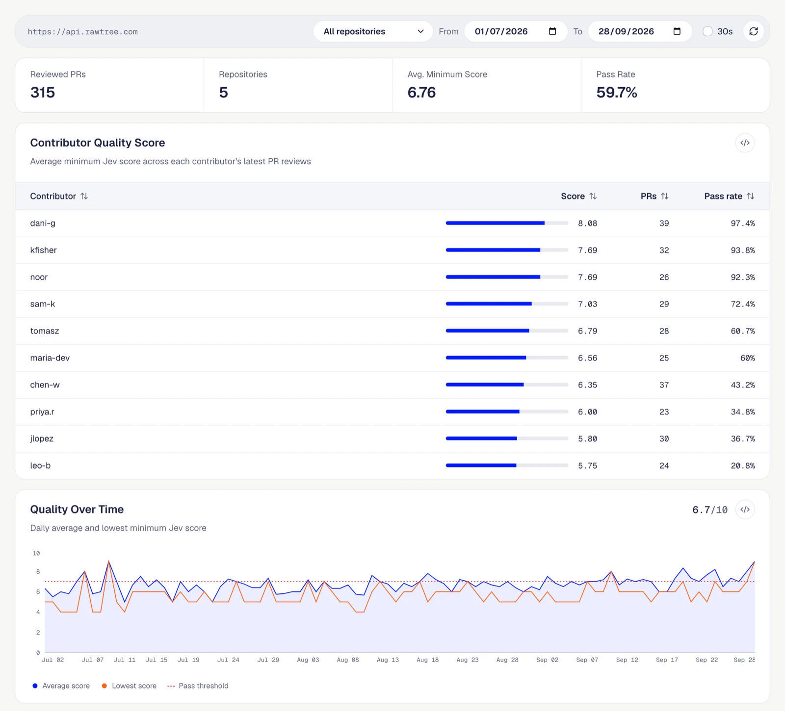

# Jev PR Quality

[](https://github.com/rawtreedb/jev-pr-quality/actions/workflows/ci.yml)
[](LICENSE)

**Add Jev-assisted pull request reviews and a live quality dashboard in two
minutes.**

## Get running in two minutes

### 1. Copy the workflow

Copy [`examples/jev-review.yml`](examples/jev-review.yml) into
`.github/workflows/jev-review.yml` in your repository, or run:

```sh
mkdir -p .github/workflows
curl -L https://raw.githubusercontent.com/rawtreedb/jev-pr-quality/main/examples/jev-review.yml \
  -o .github/workflows/jev-review.yml
```

### 2. Add two GitHub Actions secrets

In your repository, open **Settings → Secrets and variables → Actions** and add:

| Secret | Get it from | Access |
| --- | --- | --- |
| `JEV_API_KEY` | [TypeSafe console](https://console.typesafe.ai/keys) | Jev evaluation |
| `RAWTREE_JEV_API_KEY` | [RawTree](https://rawtree.com) → **Settings → API keys** | Write-only |

Create a RawTree database (for example, `jev_prs`) and make it the write key's
default database. For several repositories, use organization secrets scoped to
the repositories you want to review.

### 3. See it live

Create a separate RawTree **read-only** key with the **same default database** as
the write key. Open the [live dashboard](https://jev-pr-quality.vercel.app) and
paste it in. The key stays in browser memory and is sent directly to RawTree.

[](https://jev-pr-quality.vercel.app)

That is it. Each new PR gets a Jev review comment and quality check, while its
structured score is appended to RawTree and appears in the dashboard.

## How it works

```text
Pull request
    │
    ▼
Jev review ──────► PR comment + required check
    │
    ▼
RawTree event ───► Multi-repository dashboard
```

Jev evaluates the complete PR diff across 19 typed software-quality dimensions.
The GitHub Action publishes the result on the PR, optionally appends a structured
event to RawTree, and fails when any applicable dimension is below the configured
threshold. The included dashboard keeps only the latest run for each
`(repository, pull request)` before calculating scores.

- **One action:** review, comment, artifact, quality gate, and event logging.
- **Multi-repository by default:** compare an organization or focus on one repo.
- **Self-hosted frontend:** deploy with Node.js or Docker; no dashboard backend.
- **Safe token split:** CI gets a write-only key, viewers use read-only keys.

`@main` is the preview channel while the project is under review. Pin the first
stable `@v1` release when it is published.

Every event contains `github.repository`, so several repositories can safely
write to one RawTree database and appear together in the dashboard.

## Why Jev?

Most AI code review produces prose: useful in the moment, difficult to compare,
and quickly lost in a PR timeline. Jev produces typed, repeatable ratings across
19 software-quality dimensions. That makes the review both actionable now and
measurable later.

Jev reviews the complete PR diff rather than a sample. A PR fails when any
applicable dimension falls below the threshold, so one critical weakness cannot
hide behind a good average. Tests remain the source of truth and humans retain
the final decision; Jev adds a consistent quality lens between them.

## Configuration

The defaults are the public convention and normally should not be changed:

| Setting | Default |
| --- | --- |
| Minimum score | `7` |
| RawTree API | `https://api.rawtree.com` |
| Table | `jev_pr_reviews` |
| Database | API key's default database |

Override the database, table, or endpoint only to isolate a private installation.
Never distribute a shared write token in a public workflow or frontend.

## Public dashboard, private data

The frontend itself is safe to publish. It contains no credentials and has no
server-side session or proxy. Each viewer supplies their own RawTree read-only
key, which remains in that browser tab's memory. Data visibility is therefore
controlled by the RawTree key—not by the deployment being public or private.

## Self-host the dashboard

Requirements: Node.js 24 and npm.

```sh
npm ci
npm run dev
```

Open <http://localhost:3000> and enter a RawTree **read-only** key. The key stays
in the browser tab's memory and is sent directly to `https://api.rawtree.com`.
It is never persisted or sent to the dashboard server.

The dashboard starts with all repositories combined and provides a repository
selector. It compares only real `jev_pr_review` events on rubric version `1`;
unrelated records are excluded.

### Vercel

Import this repository as a Next.js project with the repository root as the root
directory. The committed build command and Node.js version are sufficient; no
Vercel environment variables are required. Do not add either API key to Vercel:
the write-only key belongs in GitHub Actions, and viewers enter read-only keys at
runtime.

### Docker

```sh
docker build -t jev-pr-quality .
docker run --rm -p 3000:3000 jev-pr-quality
```

The image runs as an unprivileged user and contains no credentials. Put TLS in
front of it before asking users to enter read keys.

## What Jev receives

The action sends the PR title and body, the complete three-dot Git diff with 20
lines of context, and root `AGENTS.md` when present. It does not execute PR code
or upload the full repository. Jev reviews the text diff; changed binary files
are listed as not assessed in the PR comment and report. Large diffs and PRs
that only change binary files fail closed rather than producing a misleading
review.

Jev is an advisory review signal that complements tests and human review. Scores
are model judgments, not proof of correctness. Historical comparisons should use
the same rubric and model period.

## Contributing

Contributions are welcome. See [CONTRIBUTING.md](CONTRIBUTING.md) for local setup,
checks, and event-schema expectations.

## Development

```sh
npm ci
npm run lint
npm run build
npm test
npm ci --ignore-scripts --prefix scripts/jev-review
npm test --prefix scripts/jev-review
```

## Attribution and licenses

Rubric data and question wording are adapted from
[NiazMorshed2007/jev-review](https://github.com/NiazMorshed2007/jev-review), commit
`57690af54ef7d862c2483342c1e61c14dffcf727`, under MIT. Its notice is retained in
[`scripts/jev-review/LICENSE`](scripts/jev-review/LICENSE). The rest of this
repository is licensed under Apache-2.0.
